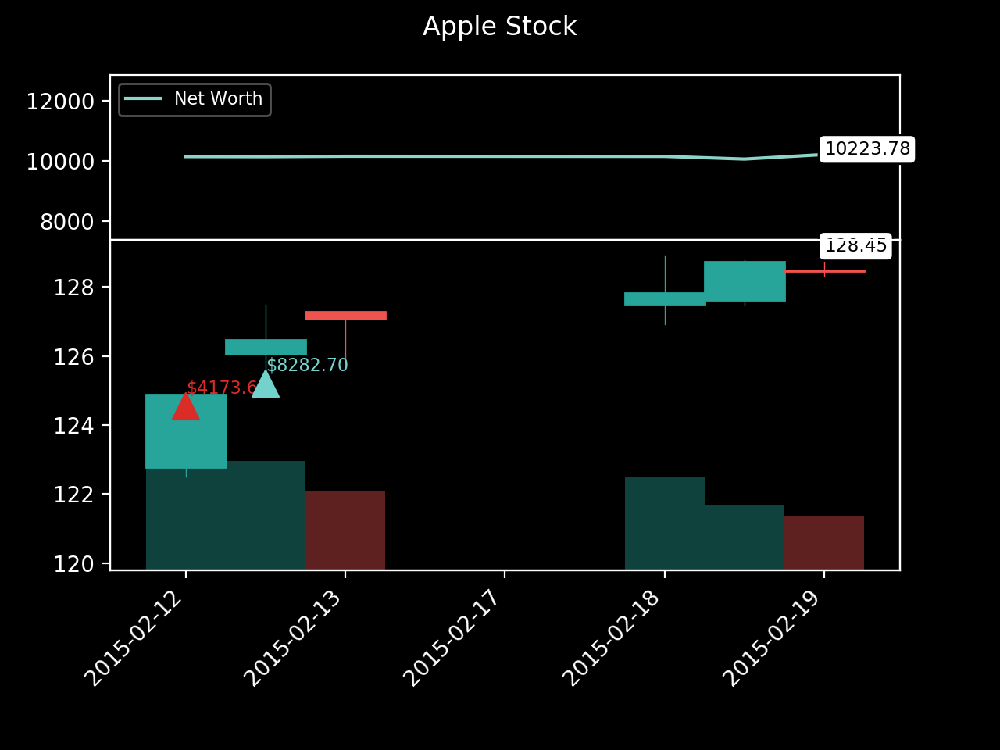
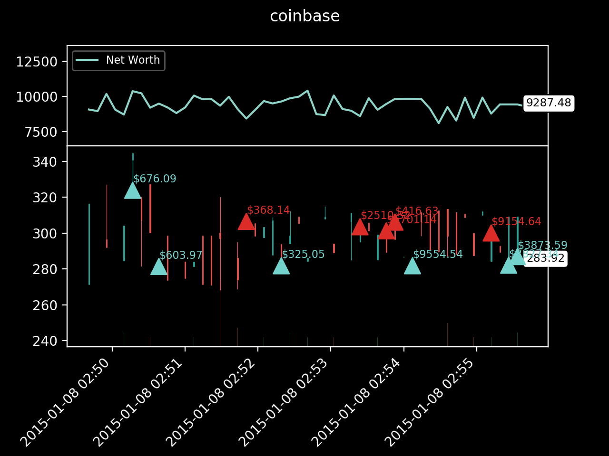

# RLTradingStrategy
A trading agent of reinforcement learning in a customised trading environment, supports the following assets trading:
- stocks 
- bitcoin
- options
    - trading in options is superior to trading in stocks directly ([why](https://www.asx.com.au/documents/resources/UnderstandingOptions.pdf)), so the focus is options trading
    - the options traded are index options, which add exposures to the market in one trade; later might include trading individual stock options  
    - the trading strategies only involves taking the options, i.e. no writting options
- FX

Assumptions: 
- all trades are in AUD
- trading platform is ANZ for stocks, options and FX
- trading platform for bitcoin is Coinbase
- taxation is not considered 

## How to run

`python testEnv.py --env_name <asset-to-be-traded>`

For example, `python testEnv.py --env_name stock`

## A screenshot of the trading process
Stock example

Bbitcoin example

## Using Tenserboard
run `tensorboard --logdir==tensorboard --host=127.0.0.1`

then go to [127.0.0.1:6006](127.0.0.1:6006) in your brower

## TODO:
- [x] visualise using tensorboard
- [x] split train/test dateset 
- [ ] finalise optons and FX env 
- [ ] stream live data using Alpaca/Yahoo finance 
- [ ] enable GCP
- [ ] feature engineering
- [ ] [better reward function](https://medium.com/@SOGorman35/now-that-i-had-a-chance-to-read-your-article-in-a-bit-more-depth-ill-add-some-more-input-beyond-b71e442bb8a)
- [ ] multi-agent
- [ ] add word embedding layer for news data 
- [ ] explore different policies  
- [ ] trade multiple assets simultaneously 

## Citing
[Create custom gym environments from scratch — A stock market example](https://towardsdatascience.com/creating-a-custom-openai-gym-environment-for-stock-trading-be532be3910e)[[repo](https://github.com/notadamking/Stock-Trading-Environment)]

[Rendering elegant stock trading agents using Matplotlib and Gym](https://towardsdatascience.com/visualizing-stock-trading-agents-using-matplotlib-and-gym-584c992bc6d4)[[repo](https://github.com/notadamking/Stock-Trading-Visualization)]

[Creating Bitcoin trading bots don’t lose money](https://towardsdatascience.com/creating-bitcoin-trading-bots-that-dont-lose-money-2e7165fb0b29)[[repo](https://github.com/notadamking/RLTrader)]

[Optimizing deep learning trading bots using state-of-the-art techniques](https://towardsdatascience.com/using-reinforcement-learning-to-trade-bitcoin-for-massive-profit-b69d0e8f583b)

